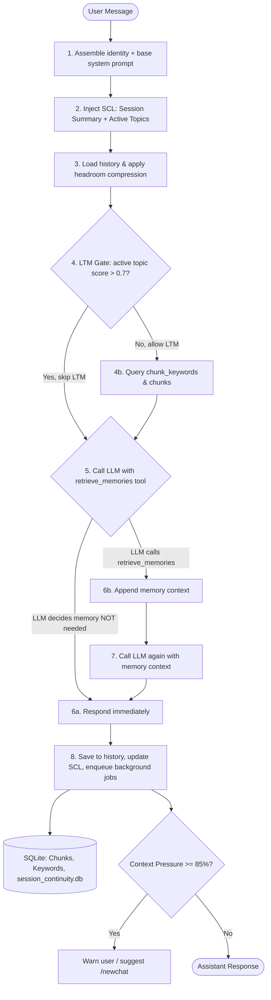

# Athena v1.3 — Memory-First Dialogue Agent

Athena is an intelligent, memory-first dialogue agent designed to run across multiple inference providers while maintaining persistent long-term memory, session-level working memory, context window compression, a multi-service provider management architecture, and a standardized skill framework with fine-grained security policies.

---

## ── Architecture Overview ──

Athena has two parallel execution paths in `run_one_turn()`:

### Path A — Subagent Task Execution (Managed Skill Framework)
For tasks requiring specialised capabilities (web search, code execution, writing, file reading, etc.), Athena routes through the Task Planner to resolve namespaced capabilities before executing inside a sandboxed `SkillContext`.

```
User Message
    ↓
Task Planner  ← queries memory & resolves namespaced capability (e.g., "search.web")
    ↓
Capability Registry  ← matches capability to registered Skill
    ↓
Skill Policy Engine  ← validates permissions (network.http, storage.artifacts)
    ↓
Worker Container  ← injects SkillContext & manages lifecycle (on_initialize -> run -> on_teardown)
    ↓
Skill Execution  ← utilizes ServiceProvidersManager & SearchCache
    ↓
SubagentResult { user_output, aal_summary, memory_payload: [], artifacts }
    ↓
Memory Gate  ← inspects artifacts & handoff summary before storing
    ↓
Long-Term Memory (SQLite Chunks)
```

### Path B — Conversational LLM with Session Continuity + Tool-Controlled Memory Retrieval
For standard conversation turns, Athena assembles a layered context window (identity → session summary → active topics → compressed history → gated LTM), then uses LLM-controlled tool calling to retrieve long-term memory only when needed.



---

## ── Running Tests ──

To run the entire hermetic test suite (**101 tests**) inside the virtual environment:

```powershell
.venv\Scripts\python.exe -m pytest
```

To run only the Session Continuity Layer tests:

```powershell
.venv\Scripts\python.exe -m pytest tests/test_session_continuity.py -v
```

---

## ── Core Features (v1.3) ──

### 1. Session Continuity Layer (`session_continuity.py`, `summarizer.py`, `background_queue.py`)

A **temporary working-memory** subsystem that sits between Recent Messages and Long-Term Memory. It survives provider rotation, minimizes tokens, and preserves conversational flow without touching the existing Chunk Memory, Retrieval Engine, or Adaptive Learning systems.

- **Incremental AAL Session Summary**: Maintains a structured, machine-readable summary of the session using Athena Agent Language (AAL) `key:value` lines (e.g. `skill:web_search:complete`, `project:athena`, `decision:approved`). Not free prose — machine-parseable and compact.
- **Active Topic Tracker with Decay**: Topics are extracted per turn, scored, and decayed over time. `ACTIVE` → `DORMANT` → `INACTIVE` based on mention frequency and recency.
- **Topic Priority System**: Each topic has a `priority` field (`LOW` | `NORMAL` | `HIGH` | `PINNED`). Pinned topics never auto-deactivate regardless of score decay — useful for long-running projects, thesis work, etc.
- **Hybrid Confidence Scoring**: The summarizer combines LLM self-confidence (×0.6) with 6 deterministic structural checks (×0.4) to validate summaries before writing. Compaction fires automatically when hybrid score < 0.7.
- **Total Prompt Pressure Gauge**: Calculates real context pressure across all layers (identity + session summary + active topics + history + LTM + user message) divided by the current provider's context window. Warns at 85%, offers `/newchat` at 95%.
- **Provider Rotation Snapshots**: Before a provider failover, Athena writes a continuity snapshot (identity, summary, active topics, recent context). The next provider loads the snapshot immediately — no cold start.
- **Session Archive + Retention**: Sessions expire → `ARCHIVED` (not deleted) → hard deleted after a configurable retention window. Enables crash recovery and debugging.
- **Maintenance Provider**: A separate `maintenance_provider` config block handles all background jobs (summarization, compaction, distillation, future reflection and embeddings) independently of the interactive LLM calls.

### 2. Standardized Skill Framework (`skills/`)
- **`SkillManifest`**: Standardized metadata contract defining `name`, `version`, `athena_api`, `capabilities`, `permissions`, and `dependencies`.
- **`SkillContext` Dependency Injection**: Provides skills with clean access to `task_id`, `artifacts_dir`, `services` (`ServiceProvidersManager`), `llm_router`, `memory_reader`, and logging without global coupling.
- **Skill Lifecycle Hooks**: Formal hooks for resource management: `on_initialize(ctx)`, `run(ctx, task)`, and `on_teardown(ctx)`.
- **`SkillPolicyEngine`**: Security guardrails enforcing granular permissions (`permission.network.http`, `permission.filesystem.write`, `permission.storage.artifacts`, `permission.shell.execute`) prior to execution.
- **Runtime Skill Loader**: Scans directories and dynamically verifies, validates, and registers skills into the `CapabilityRegistry`.

### 3. Multi-Service Provider Manager (`service_providers_manager.py`)
- **Multi-Category Management**: Manages providers partitioned across service categories (`search`, `llm`, `image`, `embedding`, `ocr`, `maps`, `storage`, `email`).
- **Dynamic Multi-Factor Selection**: Scores provider health dynamically based on health score ($0.4$), historical success rate ($0.3$), average latency ($0.3$), and static priority tie-breaking.
- **Key Rotation & Failover**: Automatic key rotation and provider failover on transient outages.

### 4. Web Search Skill & Provider Adapters (`skills/web_search/`)
- **Namespaced Capabilities**: Supports `search.web`, `search.news`, `search.image`, `search.code`, `search.maps`, `search.academic`, `search.documentation`.
- **Multi-Provider Adapters**: Out-of-the-box adapters for **Tavily**, **Brave Search**, **Serper**, **Exa**, and **SearXNG** (self-hosted keyless).
- **Search Cache (`search_cache.py`)**: SHA-256 query hashing with configurable TTL to eliminate redundant API quota usage.
- **Artifact-First Outputs**: Generates structured `search_results.json`, `citations.json`, and `raw_provider_response.json` artifacts, setting `memory_payload = []` to delegate memory ingestion cleanly to downstream gating.

### 5. Next-Generation Chunk Memory & Adaptive Learning
- **Intelligent Chunk Generation**: Chronological segmentation enriched with keywords, themes, and entities.
- **Active/Passive Sweep**: Enforces a configurable active token budget (`50,000` tokens).
- **5-Stage Staged Retrieval**: Intent classifier → Active/Passive keyword overlap → Cosine similarity → Desperation → Fallback.
- **Adaptive Learning Engine**: Applies skip mark penalties and rewards based on user corrections.
- **LTM Gate**: When an active topic has score > 0.7 and covers the user query, long-term memory retrieval is skipped entirely — reducing unnecessary DB reads during focused conversations.

---

## ── Slash Commands ──

| Command | Description |
|---|---|
| `/topics` | Display active session topics with scores, status, and priority |
| `/pin <topic>` | Pin a topic — it won't auto-deactivate regardless of inactivity |
| `/unpin <topic>` | Reset a pinned topic to NORMAL priority |
| `/newchat` | Archive current session and carry context over to a fresh one |
| `/caveman` | Toggle Caveman mode (compressed ACK-style responses) |
| `/debug` | Show last retrieval trace and diagnostic info |
| `/trace` | Show staged retrieval trace for the last query |
| `/subagent` | Show the last subagent execution summary |
| `/learning` | Show adaptive retrieval statistics |
| `/rollback` | Reset all retrieval skip marks and query statistics |
| `/model <id>` | Override the active model |
| `/exit` | End the session |

---

## ── Onboarding & Setup ──

1. **Onboard Providers**:
   ```powershell
   .venv\Scripts\python.exe main.py onboard
   ```

2. **Start Chatting**:
   ```powershell
   .venv\Scripts\python.exe main.py chat
   ```

3. **Check System Diagnostics**:
   ```powershell
   .venv\Scripts\python.exe main.py doctor
   ```

4. **Manual Memory Sweep**:
   ```powershell
   .venv\Scripts\python.exe main.py sweep
   ```

---

## ── Configuration Reference ──

Key config blocks added in v1.3 (`~/.athena/config.yaml`):

```yaml
session_continuity:
  enabled: true
  idle_trigger_minutes: 60
  context_pressure_warn: 0.85
  context_pressure_new_chat: 0.95
  session_ttl_hours: 24
  archive_retention_hours: 72
  topic_decay_interval_minutes: 5
  topic_dormant_threshold: 0.40
  topic_inactive_threshold: 0.15

maintenance_provider:
  enabled: false
  provider: ""   # e.g. "groq"
  model: ""      # e.g. "llama-3.1-8b-instant"
```

Set `maintenance_provider.enabled: true` to offload all summarization, compaction, and distillation jobs to a dedicated cheap provider, keeping your primary provider slot free for interactive responses.

---

## ── Skill Development Guide (v1.3 Contract) ──

To add a new skill to Athena, inherit from `BaseSkill` and define a `SkillManifest`:

```python
from skills import BaseSkill, SkillManifest, SkillContext, PERM_NETWORK_HTTP, PERM_STORAGE_ARTIFACTS
from subagent_result import SubagentResult

class MyCustomSkill(BaseSkill):
    def __init__(self):
        manifest = SkillManifest(
            name="my_custom_skill",
            version="1.0.0",
            athena_api=1,
            description="Performs automated analytical tasks.",
            capabilities=["analytics.process"],
            permissions=[PERM_NETWORK_HTTP, PERM_STORAGE_ARTIFACTS]
        )
        super().__init__(manifest=manifest)

    def on_initialize(self, ctx: SkillContext) -> None:
        ctx.logger.info("Initializing custom skill workspace...")

    def run(self, ctx: SkillContext, task: str) -> SubagentResult:
        ctx.logger.info(f"Executing task: {task}")

        return SubagentResult(
            user_output="Task processed successfully.",
            aal_summary={"task": task, "skill_used": self.manifest.name, "outcome": "success", "confidence": 1.0},
            memory_payload=[],
            artifacts=[]
        )

    def on_teardown(self, ctx: SkillContext) -> None:
        ctx.logger.info("Cleaning up resources...")
```

Register the skill:
```python
import skills
skills.register(MyCustomSkill())
```
