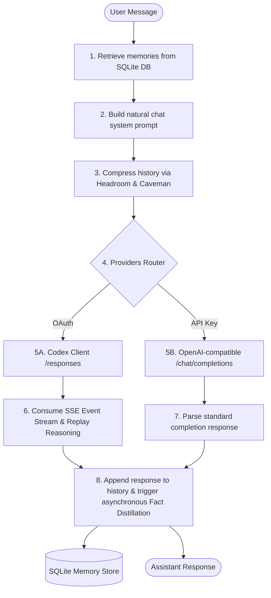

# Athena v1 — Long-Term Memory Dialogue Agent

Athena v1 is an intelligent, memory-first dialogue agent layer designed to run across multiple inference providers while maintaining persistent long-term memory, context window compression discipline, and proper keyless ChatGPT Pro/Plus OAuth integration.

---

## ── Architectural Turn Flow ──



---

## ── Core Features ──

### 1. Keyless ChatGPT Pro/Plus OAuth Integration
- **Direct Responses API Support**: Bypasses standard `/v1/chat/completions` and maps chat messages directly into Codex-compatible `/responses` input items.
- **Raw SSE Event Stream Parser**: Enforces `stream: true` in requests and consumes line-by-line Server-Sent Events (SSE). Extracts content deltas and item done states dynamically.
- **Reasoning Item Replay**: Tracks opaque, encrypted reasoning blocks (`codex_reasoning_items`) and re-injects them on subsequent turns to maintain chain-of-thought coherence.
- **Cross-Issuer Filters**: Strips reasoning blobs minted by different endpoints (e.g. xAI vs. Codex) if the session swaps providers, preventing `invalid_encrypted_content` HTTP 400 errors.

### 2. Rotational Failover Router
- Monitors consecutive request failures.
- Automatically rotates the active provider in `config.yaml` to the next configured fallback in the chain (Gemini, OpenRouter, OpenAI, Groq, Nvidia, Copilot) after 3 consecutive failures.

### 3. SQLite Memory Engine
- Persists extracted facts and reinforces them on user keyword matches.
- Implements a lazy temporal decay formula ($importance = initial\_importance \times e^{-decay\_rate \times elapsed\_turns}$) upon retrieval.
- Prevents database duplication using SHA-256 signature tracking.

### 4. Context Window Compression Discipline
- **Caveman turned history summarization**: Triggers automatically when conversational history exceeds 1000 tokens, condensing past turns into sparse, telegraphic prose.
- **Headroom AI transforms**: Compasses tool outputs and long logs using fast, native compiled token-crushers.

### 5. Interactive Setup & CLI Command Shell
- **Interactive Wizard (`main.py onboard`)**: Walks you through configuring providers and logs into browser or headless OAuth sessions.
- **Diagnostics (`main.py doctor`)**: Validates folder structures, permissions, and database health metrics.
- **Slash Commands**:
  - `/provider <provider_name>`: Switch active models on the fly during a chat session.
  - `/caveman`: Toggle between caveman style terse response instructions and natural chatbot styling.
  - `/quit` / `/exit`: Cleanly exit the session.

---

## ── Onboarding & Setup ──

1. **Onboard Providers**:
   ```powershell
   .venv\Scripts\python.exe main.py onboard
   ```
   Select your preferred provider and select authentication method `browser` or `headless` to log in keylessly.

2. **Start Chatting**:
   ```powershell
   .venv\Scripts\python.exe main.py chat
   ```

3. **Check System Diagnostics**:
   ```powershell
   .venv\Scripts\python.exe main.py doctor
   ```
