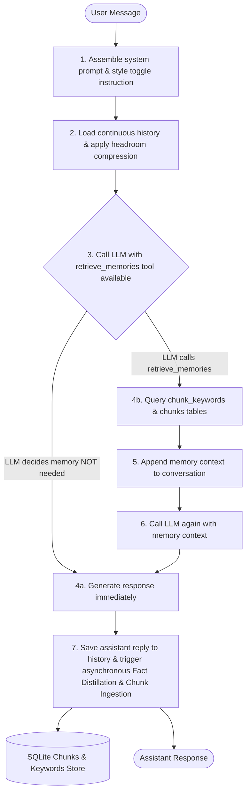

# Athena v1.1 — Long-Term Memory Dialogue Agent

Athena is an intelligent, memory-first dialogue agent layer designed to run across multiple inference providers while maintaining persistent long-term memory, context window compression discipline, proper keyless GitHub Copilot OAuth integration, and an extensible chunk-based database engine.

---

## ── Architectural Turn Flow ──

Athena leverages **LLM-controlled tool calling** to perform memory retrieval only when the model determines it needs past context, keeping standard responses latency-free:



---

## ── Running Tests ──

To run the entire hermetic test suite (55 tests) inside the virtual environment:
```powershell
.venv\Scripts\python.exe -m pytest
```


---

## ── Core Features ──

### 1. Universal Provider Manager with Multi-Key Rotation
- **Schema & Persistence (`providers.json`)**: Configured dynamically; supports registering custom OpenAI-compatible endpoints (Grok, OpenRouter, Together, DeepInfra) without hardcoding.
- **API Key Rotation**: Automatically rotates to the next API key inside a provider upon any failure (rate limits, timeouts, auth errors, quota exceeded).
- **Auto-Failover**: Automatically switches to the next healthiest provider in the fallback chain if all keys for a provider are exhausted.
- **Health Tracking**: Tracks request success/failure stats and consecutive failure rates per key and provider dynamically.
- **Self-Healing Statistics**: Automatically resets all failure counts as a last resort if all configured options fail, avoiding permanent lockouts from transient outages.

### 2. Next-Generation Memory Architecture & Lifecycle
* **Intelligent Chunk Generation**:
  - **Sentence Detection**: Deterministically segments raw conversation history while safely protecting URLs, decimals, and abbreviations.
  - **LLM-Based Enrichment**: Batches chunks to extract Caveman summaries, keywords, themes, and entities.
  - **Deterministic Fallback**: Uses local stop-word filtering if LLM providers are offline, guaranteeing memories are always created.
* **Active/Passive Lifecycle Sweep**:
  - **Token Budgeting**: Enforces a strict `active_token_budget` (default `50,000` tokens) using pre-calculated token estimates.
  - **Chronological Demotions**: Promotes recent memories to the `active` tier and automatically demotes older memories to the `passive` tier to conserve LLM context.
  - **Mixed Boundary Annotations**: Annotates chunks spanning the budget boundary as `mixed` instead of cutting them.
* **Staged Memory Retrieval Engine**:
  - **Stage 0 (Intent Classifier)**: Rules-based whole-word intent analysis (timeline, preferences, projects, etc.).
  - **Stage 1 & 2 (Active/Passive Keyword Search)**: Sub-millisecond indexed keyword overlap scans. Exits early if confidence exceeds the threshold.
  - **Stage 3 (Semantic Search)**: Computes cosine similarity of vectors using a dedicated `chunk_embeddings` table cache to prevent redundant paid API calls.
  - **Stage 4 & 5 (Desperation & Fallback)**: Scans all chunks under user error/wrong correction signals and yields non-hallucinatory safe fallbacks.
* **Metadata & Feedback Tables**:
  - **Skip Marks (`skip_marks`)**: Stores learned query-type retrieval scores to optimize retrieval relevance.
  - **User Feedback Logs (`feedback_log`)**: Maintains an append-only transaction history of user corrections for future feedback training.

### 3. Context Window Compression & Style Switcher
- **Presentation-Only Switcher (`/caveman`)**: Dynamically toggles between natural dialogue and caveman sparse prose styles by injecting instructions into the system prompt.
- **Uninterrupted History**: Keeps the entire conversation history intact across style switches, avoiding split sessions or context loss.
- **Headroom AI transforms**: Compresses tool outputs and long logs using fast, native token-crushers.

### 4. Interactive Setup & CLI Command Shell
- **Interactive Wizard (`main.py onboard`)**: Walks you through configuring default providers and API keys.
- **Diagnostics (`main.py doctor`)**: Validates folder structures, permissions, and database health metrics.
- **Manual Sweep (`main.py sweep`)**: Manually run the active/passive memory lifecycle budget sweep.
- **Slash Commands**:
  - `/providers`: Display registered providers, defaults, key counts, enabled status, active provider, and request metrics.
  - `/provider add`: Interactive wizard to register a new provider (name, type, base URL, default model, and multiple keys).
  - `/provider remove <id>`: Deletes a provider from the configuration.
  - `/provider enable/disable <id>`: Dynamically toggles a provider's active eligibility status.
  - `/provider select <id|auto>` (shortcut: `/provider <id>`): Manual active override or resets to health-based selection (`auto`).
  - `/model select <model_id|default>` (shortcut: `/model <model_id>`): Manual model override or resets to provider defaults.
  - `/caveman`: Toggle between caveman sparse prose style and natural conversational style.
  - `/quit` / `/exit`: Cleanly exit the session.

---

## ── Onboarding & Setup ──

1. **Onboard Providers**:
   ```powershell
   .venv\Scripts\python.exe main.py onboard
   ```
   Enter API keys for your preferred providers.

2. **Start Chatting**:
   ```powershell
   .venv\Scripts\python.exe main.py chat
   ```

3. **Check System Diagnostics**:
   ```powershell
   .venv\Scripts\python.exe main.py doctor
   ```

