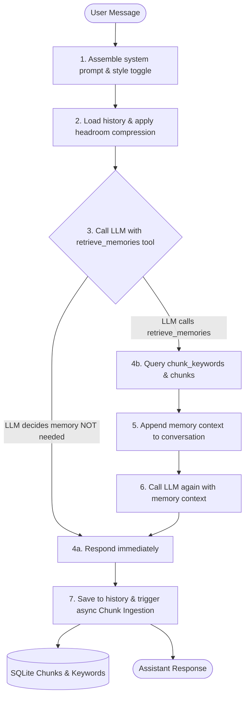

# Athena v1.3 — Dialogue Agent with Standardized Skill Framework & Multi-Service Providers

Athena is an intelligent, memory-first dialogue agent designed to run across multiple inference providers while maintaining persistent long-term memory, context window compression, a multi-service provider management architecture, and a standardized skill framework with fine-grained security policies.

---

## ── Architecture Overview ──

Athena has two parallel execution paths in `run_one_turn()`:

### Path A — Subagent Task Execution (Managed Skill Framework)
For tasks requiring specialised capabilities (web search, code execution, writing, file reading, etc.), Athena routes through the Task Planner to resolve namespaced capabilities before executing inside a sandboxed `SkillContext`.

```
User Message
    ↓
Task Planner  ← queries memory & resolves namespaced capability (e.g., "search.web")
    ↓
Capability Registry  ← matches capability to registered Skill
    ↓
Skill Policy Engine  ← validates permissions (network.http, storage.artifacts)
    ↓
Worker Container  ← injects SkillContext & manages lifecycle (on_initialize -> run -> on_teardown)
    ↓
Skill Execution  ← utilizes ServiceProvidersManager & SearchCache
    ↓
SubagentResult { user_output, aal_summary, memory_payload: [], artifacts }
    ↓
Memory Gate  ← inspects artifacts & handoff summary before storing
    ↓
Long-Term Memory (SQLite Chunks)
```

### Path B — Conversational LLM with Tool-Controlled Memory Retrieval
For standard conversation turns, Athena uses LLM-controlled tool calling to retrieve memory only when the model decides it needs past context.



---

## ── Running Tests ──

To run the entire hermetic test suite (**84 tests**) inside the virtual environment:

```powershell
.venv\Scripts\python.exe -m pytest
```

---

## ── Core Features (v1.3) ──

### 1. Standardized Skill Framework (`skills/`)
- **`SkillManifest`**: Standardized metadata contract defining `name`, `version`, `athena_api`, `capabilities`, `permissions`, and `dependencies`.
- **`SkillContext` Dependency Injection**: Provides skills with clean access to `task_id`, `artifacts_dir`, `services` (`ServiceProvidersManager`), `llm_router`, `memory_reader`, and logging without global coupling.
- **Skill Lifecycle Hooks**: Formal hooks for resource management: `on_initialize(ctx)`, `run(ctx, task)`, and `on_teardown(ctx)`.
- **`SkillPolicyEngine`**: Security guardrails enforcing granular permissions (`permission.network.http`, `permission.filesystem.write`, `permission.storage.artifacts`, `permission.shell.execute`) prior to execution.
- **Runtime Skill Loader**: Scans directories and dynamically verifies, validates, and registers skills into the `CapabilityRegistry`.

### 2. Multi-Service Provider Manager (`service_providers_manager.py`)
- **Multi-Category Management**: Manages providers partitioned across service categories (`search`, `llm`, `image`, `embedding`, `ocr`, `maps`, `storage`, `email`).
- **Dynamic Multi-Factor Selection**: Scores provider health dynamically based on health score ($0.4$), historical success rate ($0.3$), average latency ($0.3$), and static priority tie-breaking.
- **Key Rotation & Failover**: Automatic key rotation and provider failover on transient outages.

### 3. Web Search Skill & Provider Adapters (`skills/web_search/`)
- **Namespaced Capabilities**: Supports `search.web`, `search.news`, `search.image`, `search.code`, `search.maps`, `search.academic`, `search.documentation`.
- **Multi-Provider Adapters**: Out-of-the-box adapters for **Tavily**, **Brave Search**, **Serper**, **Exa**, and **SearXNG** (self-hosted keyless).
- **Search Cache (`search_cache.py`)**: SHA-256 query hashing with configurable TTL to eliminate redundant API quota usage.
- **Artifact-First Outputs**: Generates structured `search_results.json`, `citations.json`, and `raw_provider_response.json` artifacts, setting `memory_payload = []` to delegate memory ingestion cleanly to downstream gating.

### 4. Next-Generation Chunk Memory & Adaptive Learning
- **Intelligent Chunk Generation**: Chronological segmentation enriched with keywords, themes, and entities.
- **Active/Passive Sweep**: Enforces a configurable active token budget (`50,000` tokens).
- **5-Stage Staged Retrieval**: Intent classifier -> Active/Passive keyword overlap -> Cosine similarity -> Desperation -> Fallback.
- **Adaptive Learning Engine**: Applies skip mark penalties and rewards based on user corrections.

---

## ── Onboarding & Setup ──

1. **Onboard Providers**:
   ```powershell
   .venv\Scripts\python.exe main.py onboard
   ```

2. **Start Chatting**:
   ```powershell
   .venv\Scripts\python.exe main.py chat
   ```

3. **Check System Diagnostics**:
   ```powershell
   .venv\Scripts\python.exe main.py doctor
   ```

4. **Manual Memory Sweep**:
   ```powershell
   .venv\Scripts\python.exe main.py sweep
   ```

---

## ── Skill Development Guide (v1.3 Contract) ──

To add a new skill to Athena, inherit from `BaseSkill` and define a `SkillManifest`:

```python
from skills import BaseSkill, SkillManifest, SkillContext, PERM_NETWORK_HTTP, PERM_STORAGE_ARTIFACTS
from subagent_result import SubagentResult

class MyCustomSkill(BaseSkill):
    def __init__(self):
        manifest = SkillManifest(
            name="my_custom_skill",
            version="1.0.0",
            athena_api=1,
            description="Performs automated analytical tasks.",
            capabilities=["analytics.process"],
            permissions=[PERM_NETWORK_HTTP, PERM_STORAGE_ARTIFACTS]
        )
        super().__init__(manifest=manifest)

    def on_initialize(self, ctx: SkillContext) -> None:
        ctx.logger.info("Initializing custom skill workspace...")

    def run(self, ctx: SkillContext, task: str) -> SubagentResult:
        ctx.logger.info(f"Executing task: {task}")
        
        # Access injected services safely
        # manager = ctx.services
        # artifacts_path = ctx.artifacts_dir / "output.json"

        return SubagentResult(
            user_output="Task processed successfully.",
            aal_summary={"task": task, "skill_used": self.manifest.name, "outcome": "success", "confidence": 1.0},
            memory_payload=[],
            artifacts=[]
        )

    def on_teardown(self, ctx: SkillContext) -> None:
        ctx.logger.info("Cleaning up resources...")
```

Register the skill:
```python
import skills
skills.register(MyCustomSkill())
```
